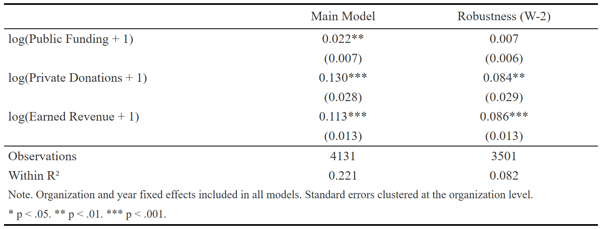
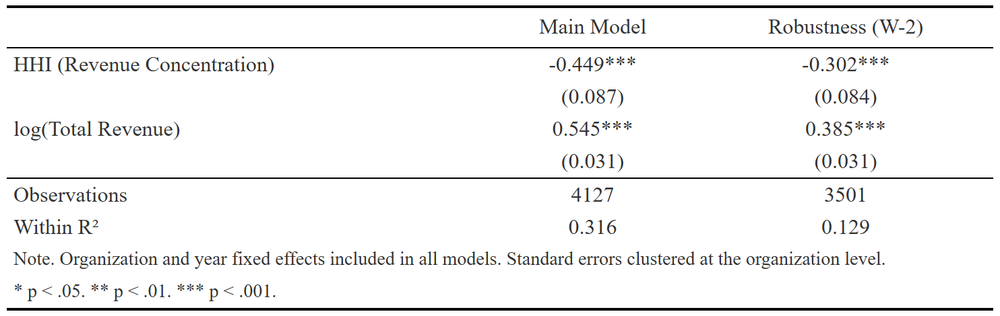

```{=html}
<div class="page-container">
  <div class="project-page">

    <a href="../index.html#projects" class="back-link">
      <i class="ti ti-arrow-left" aria-hidden="true"></i> Back to projects
    </a>

    <div class="proj-header">
      <div class="proj-tags">
        <span class="proj-tag tag-blue">Academic Paper</span>
        <span class="proj-tag tag-conf">50th Annual STP&A Conference · October 2026</span>
      </div>
      <div class="proj-tags" style="margin-top: 6px;">
        <span class="proj-tag tag-amber">Fixed Effects · HHI Analysis</span>
        <span class="proj-tag tag-gray">Nonprofit Labor · Finance · Arts Policy</span>
        <span class="proj-tag tag-teal">R · fixest · Quarto</span>
      </div>
      <h1 class="proj-title">When More Funding Is Not Enough: Revenue Concentration and Labor Investment in Nonprofit Performing Arts Organizations</h1>
      <p class="proj-desc">Panel data analysis examining how public funding, private donations, and revenue concentration shape personnel expenses in nonprofit performing arts organizations, using the SMU DataArts National Dataset (2019–2024).</p>
      <div class="collab-note">
        <i class="ti ti-users" aria-hidden="true"></i>
        <span>Co-authored with Lizzy Jeong and Marietta Lopez Moreira. My contributions: data cleaning, fixed-effects regression analysis and robustness checks in R, and the Data, Methods, and Results sections.</span>
      </div>
    </div>

    <div class="proj-actions">
      <a href="03_Paper_Haedodam-Kim.pdf" target="_blank" class="btn-primary">
        <i class="ti ti-file-text" aria-hidden="true"></i> Read Full Paper
      </a>
    </div>

    <div class="proj-meta">
      <div class="meta-item">
        <p class="meta-label">Year</p>
        <p class="meta-val">2026</p>
      </div>
      <div class="meta-item">
        <p class="meta-label">Type</p>
        <p class="meta-val">Course Assignment</p>
      </div>
      <div class="meta-item">
        <p class="meta-label">Course</p>
        <p class="meta-val">Advanced Data Analysis</p>
      </div>
      <div class="meta-item">
        <p class="meta-label">Tools</p>
        <p class="meta-val">R · fixest · modelsummary · Quarto</p>
      </div>
    </div>

    <div class="proj-stats">
  <div class="stat-card">
    <p class="stat-num stat-teal">2019–2024</p>
    <p class="stat-label">fiscal years covered</p>
  </div>
  <div class="stat-card">
    <p class="stat-num stat-blue">4,131</p>
    <p class="stat-label">organization-year observations</p>
  </div>
  <div class="stat-card">
    <p class="stat-num stat-amber">7</p>
    <p class="stat-label">NTEE performing arts categories analyzed</p>
  </div>
</div>

    <div class="proj-section">
      <h2 class="section-title">Background</h2>
      <p class="body-text">Nonprofit performing arts organizations are labor-intensive: cultural production depends on artists, administrative staff, and production crews. Yet many operate under uncertain financial conditions, balancing public funding, private donations, and earned revenue. Whether their funding structure provides room to invest in people is therefore a pressing policy question.</p>
      <p class="body-text">This study connects nonprofit finance, urban cultural policy, and resource dependence theory. Drawing on Pfeffer &amp; Salancik (1978), it argues that heavy reliance on a single revenue source may reduce organizational discretion — constraining labor investment even when total resources are adequate.</p>
    </div>

    <div class="proj-section">
      <h2 class="section-title">Key findings</h2>
      <ul class="finding-list">
        <li class="finding-item">
          <div class="finding-icon fi-teal">
            <i class="ti ti-trending-up" aria-hidden="true"></i>
          </div>
          <p class="finding-text"><strong>Private donations have the strongest link to personnel spending.</strong> A 1% increase in private donations is associated with a 0.130% increase in total personnel expenses (p &lt; .001) — nearly 6× the effect of public funding — suggesting private giving converts more directly into labor investment.</p>
        </li>
        <li class="finding-item">
          <div class="finding-icon fi-blue">
            <i class="ti ti-building-bank" aria-hidden="true"></i>
          </div>
          <p class="finding-text"><strong>Public funding has a modest but significant association.</strong> A 1% increase in public funding is associated with a 0.022% increase in personnel expenses (p &lt; .01), though this association does not hold in the W-2 robustness check, suggesting restrictions may limit direct labor use.</p>
        </li>
        <li class="finding-item">
          <div class="finding-icon fi-amber">
            <i class="ti ti-alert-triangle" aria-hidden="true"></i>
          </div>
          <p class="finding-text"><strong>Revenue concentration is the strongest predictor overall.</strong> Holding total revenue constant, a 0.1-unit increase in HHI is associated with a 4.4% decrease in personnel expenses (p &lt; .001), confirmed by the W-2 robustness check.</p>
        </li>
      </ul>
    </div>

   <div class="table-grid">
  <div>
    <p class="table-caption">Table 1. Funding Sources and Personnel Expenses</p>
    
  </div>
  <div>
    <p class="table-caption">Table 2. Revenue Concentration and Personnel Expenses</p>
    
  </div>
</div>

    <div class="proj-section">
      <h2 class="section-title">Implications</h2>
      <p class="body-text">For arts nonprofit managers: financial strategies should go beyond increasing revenue to actively managing revenue composition — over-reliance on a single source limits workforce flexibility even when resources are available. For funders and policymakers: supporting more balanced funding portfolios may strengthen these organizations' capacity to invest in labor and contribute to cultural and community development goals.</p>
      <div class="highlight-box">
        Revenue diversification may be a key condition for a more sustainable nonprofit arts workforce — more funding matters, but funding structure matters as well.
      </div>
    </div>

  </div>
</div>
```
