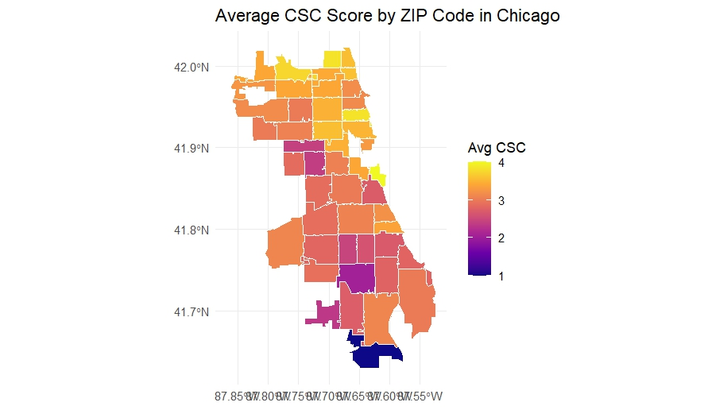
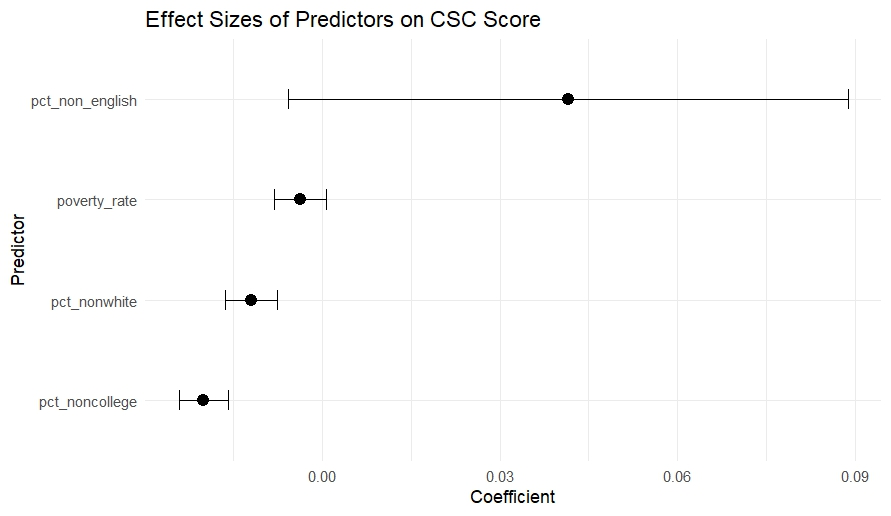
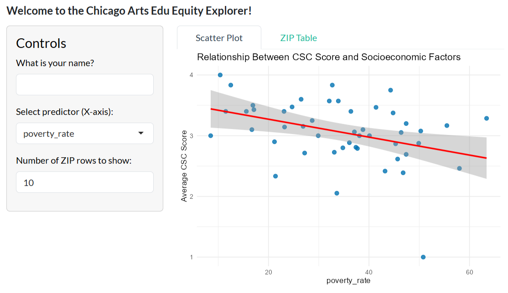
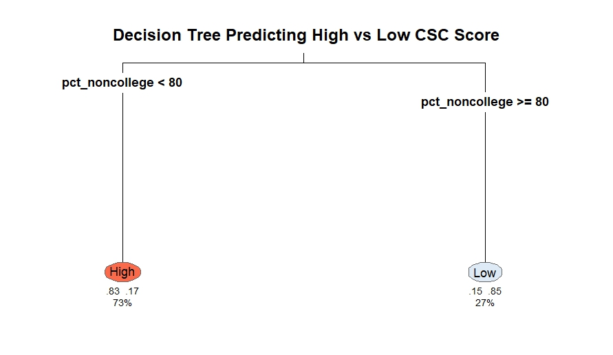

```{=html}
<style>
#title-block-header { display: none !important; }
</style>

<div class="page-container">

<div class="proj-header">
  <a href="../index.html" style="font-size:13px; color:#999; display:flex; align-items:center; gap:6px; margin-bottom:1rem; text-decoration:none;">
    ← Back to projects
  </a>
  <div class="proj-tags" style="margin-bottom:0.75rem;">
    <span class="proj-tag tag-blue">Data Analysis Report</span>
    <span class="proj-tag tag-amber">Regression · Spatial Analysis</span>
    <span class="proj-tag tag-gray">Arts Education · Equity</span>
    <span class="proj-tag tag-teal">R · Shiny · Quarto · GitHub</span>
  </div>
  <h1>Arts Education Equity in Chicago: A Data Analysis of Arts Access in Public Schools</h1>
  <p>ZIP code-level analysis of Creative Schools Certification (CSC) scores across Chicago, combining ACS data, spatial mapping, regression, an interactive Shiny dashboard, and a decision tree classifier to examine how socioeconomic conditions shape arts education access.</p>
</div>

<div style="margin-top:1rem; padding-bottom:2rem; border-bottom:0.5px solid #e0e0e0; display:flex; gap:8px; flex-wrap:wrap;">
  <a href="04_Report_Haedodam-Kim.pdf" target="_blank"
     style="display:inline-flex; align-items:center; gap:6px; font-size:13px; font-weight:500; padding:7px 16px; background:#4ba8c8; color:#E1F5EE !important; border-radius:6px; text-decoration:none !important;">
    <i class="ti ti-file-text" aria-hidden="true"></i> Read Full Report
  </a>
  <a href="https://github.com/Haedodam/Arts-Education-Equity-in-Chicago" target="_blank"
     style="display:inline-flex; align-items:center; gap:6px; font-size:13px; font-weight:500; padding:7px 16px; background:transparent; color:#1a1a1a !important; border:0.5px solid #ccc; border-radius:6px; text-decoration:none !important;">
    <i class="ti ti-brand-github" aria-hidden="true"></i> View Code
  </a>
</div>

<div class="proj-meta">
  <div><p class="meta-label">Year</p><p class="meta-value">2025</p></div>
  <div><p class="meta-label">Type</p><p class="meta-value">Course Assignment</p></div>
  <div><p class="meta-label">Course</p><p class="meta-value">Coding Civic Data Applications</p></div>
  <div><p class="meta-label">Tools</p><p class="meta-value">R · tidycensus · Shiny · Quarto</p></div>
</div>

<div class="proj-section">
  <h2>Overview</h2>
  <p>Although CPS designates the arts as a "core subject," the quality and availability of arts instruction vary considerably across neighborhoods. Arts teacher vacancies are disproportionately concentrated in South and West Side neighborhoods, many schools do not meet the required 120 minutes of weekly arts instruction, and facility disparities remain persistent across the district.</p>
  <div style="background:#f8f8f8; border-radius:8px; padding:1rem 1.25rem; margin-top:1rem; font-size:14px; color:#555; line-height:1.6; font-style:italic;">
    "How are neighborhood-level socioeconomic factors associated with Creative Schools Certification (CSC) outcomes across Chicago ZIP codes, and what do these relationships imply for advancing arts education equity in CPS?"
  </div>
</div>

<div class="proj-section">
  <h2>Analytical Approach</h2>
  <p>This project merges ZIP code-level socioeconomic indicators from the American Community Survey (ACS) 2022 5-year estimates with Creative Schools Certification (CSC) data from Ingenuity's ArtLook Maps. The analysis proceeds in four steps:</p>
  <div style="display:grid; grid-template-columns:repeat(4,1fr); gap:8px; margin:1.25rem 0;">
    <div style="background:#f8f8f8; border-radius:8px; padding:0.75rem; text-align:center;">
      <p class="finding-num">01</p>
      <p style="font-size:12px; color:#555; line-height:1.4;">Spatial mapping of CSC scores by ZIP code</p>
    </div>
    <div style="background:#f8f8f8; border-radius:8px; padding:0.75rem; text-align:center;">
      <p class="finding-num">02</p>
      <p style="font-size:12px; color:#555; line-height:1.4;">OLS regression — 4 socioeconomic predictors</p>
    </div>
    <div style="background:#f8f8f8; border-radius:8px; padding:0.75rem; text-align:center;">
      <p class="finding-num">03</p>
      <p style="font-size:12px; color:#555; line-height:1.4;">Interactive Shiny dashboard for stakeholder exploration</p>
    </div>
    <div style="background:#f8f8f8; border-radius:8px; padding:0.75rem; text-align:center;">
      <p class="finding-num">04</p>
      <p style="font-size:12px; color:#555; line-height:1.4;">Decision tree classifier to identify combinational patterns</p>
    </div>
  </div>
</div>

<div class="proj-section">
  <h2>Visualizations</h2>
  <div style="display:grid; grid-template-columns:1fr 1fr; gap:1.5rem; margin-top:1rem;">
    <div>
      
      <p style="font-size:12px; color:#999; margin-top:6px; line-height:1.4;">Figure 1. Average CSC Score by ZIP Code. Higher scores concentrated in the North Side; lower scores in South and West Sides.</p>
    </div>
    <div>
      
      <p style="font-size:12px; color:#999; margin-top:6px; line-height:1.4;">Figure 2. Regression coefficient plot. Most predictors show weak associations with wide confidence intervals crossing zero.</p>
    </div>
    <div>
      
      <p style="font-size:12px; color:#999; margin-top:6px; line-height:1.4;">Figure 3. Interactive Shiny dashboard allowing stakeholders to explore relationships between socioeconomic predictors and CSC scores.</p>
    </div>
    <div>
      
      <p style="font-size:12px; color:#999; margin-top:6px; line-height:1.4;">Figure 4. Decision tree classifier. Educational attainment (pct_noncollege) emerged as the only meaningful split — ZIP codes with pct_noncollege &lt; 80% classified as High CSC with 83% probability.</p>
    </div>
  </div>
</div>

<div class="proj-section">
  <h2>Key Findings</h2>
  <div class="findings-grid">
    <div class="finding-card">
      <p class="finding-num">01</p>
      <p class="finding-text">Clear North-South divide — higher CSC scores in North and central ZIP codes, lower scores in South and West Sides.</p>
    </div>
    <div class="finding-card">
      <p class="finding-num">02</p>
      <p class="finding-text">Poverty rate, racial composition, and linguistic diversity show weak, statistically insignificant associations with CSC scores (R² = 0.55).</p>
    </div>
    <div class="finding-card">
      <p class="finding-num">03</p>
      <p class="finding-text">Educational attainment was the only meaningful predictor in the decision tree — ZIP codes with pct_noncollege &lt; 80% classified as High CSC with 83% probability.</p>
    </div>
    <div class="finding-card">
      <p class="finding-num">04</p>
      <p class="finding-text">Disparities are likely driven by structural factors — staffing, budgets, partnership networks — not ZIP-level demographics alone.</p>
    </div>
  </div>
</div>

<div class="proj-section">
  <h2>Policy Implications</h2>
  <div style="display:grid; grid-template-columns:1fr 1fr; gap:0.75rem; margin-top:1rem;">
    <div class="finding-card">
      <p style="font-size:13px; font-weight:500; color:#1a1a1a; margin-bottom:4px;">Prioritize structural needs</p>
      <p class="finding-text">Direct arts educators and resources to ZIP codes with staffing shortages and facility limitations, not based on demographic characteristics.</p>
    </div>
    <div class="finding-card">
      <p style="font-size:13px; font-weight:500; color:#1a1a1a; margin-bottom:4px;">Expand community partnerships</p>
      <p class="finding-text">Facilitate more arts partnerships for historically under-resourced schools to mitigate staffing and facility gaps.</p>
    </div>
    <div class="finding-card">
      <p style="font-size:13px; font-weight:500; color:#1a1a1a; margin-bottom:4px;">Improve data transparency</p>
      <p class="finding-text">Support schools with CSC reporting and integrate real-time indicators such as staffing stability and partner engagement.</p>
    </div>
    <div class="finding-card">
      <p style="font-size:13px; font-weight:500; color:#1a1a1a; margin-bottom:4px;">Center equity in policy design</p>
      <p class="finding-text">Lower CSC scores reflect structural conditions, not community deficiencies. Results should guide support, not punitive accountability measures.</p>
    </div>
  </div>
</div>

<div class="proj-section">
  <h2>Limitations</h2>
  <div style="background:#f8f8f8; border-left:3px solid #e0e0e0; border-radius:0 8px 8px 0; padding:1rem 1.25rem;">
    <p style="font-size:14px; color:#555; line-height:1.7; margin:0;">This analysis relies on ZIP code-level aggregates, which may mask within-ZIP variation. CSC data depends on school self-reporting, and schools with incomplete submissions — often those with fewer staff — may be underrepresented. ACS estimates are five-year averages that may not reflect recent neighborhood changes. Findings should be read as diagnostic signals, not causal claims.</p>
  </div>
</div>

</div>
```
