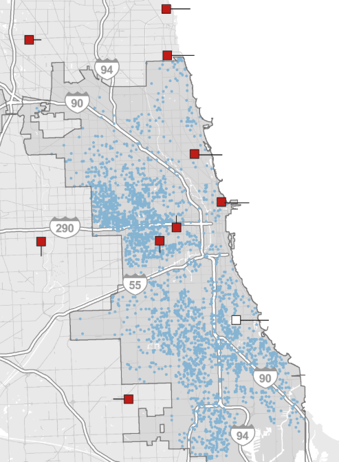

```{=html}
<style>
#title-block-header { display: none !important; }
</style>

<div class="page-container">

<div class="proj-header">
  <a href="../index.html" style="font-size:13px; color:#999; display:flex; align-items:center; gap:6px; margin-bottom:1rem; text-decoration:none;">
    ← Back to projects
  </a>
  <div class="proj-tags" style="margin-bottom:0.75rem;">
    <span class="proj-tag tag-blue">Policy Memo</span>
    <span class="proj-tag tag-amber">Decision Matrix · BOTEC</span>
    <span class="proj-tag tag-gray">Public Health</span>
  </div>
  <h1>A Policy Memo: Reducing Geographic Disparities in Trauma Care Access in Cook County</h1>
  <p>A policy memo diagnosing geographic disparities in trauma care access in Cook County through a five-step sequential model and evaluating four policy alternatives using a weighted decision matrix.</p>
</div>

<div style="margin-top:1rem; padding-bottom:2rem; border-bottom:0.5px solid #e0e0e0;">
  <a href="05_Policy-Memo_Haedodam-Kim.pdf" target="_blank"
     style="display:inline-flex; align-items:center; gap:6px; font-size:13px; font-weight:500; padding:7px 16px; background:#4ba8c8; color:#E1F5EE !important; border-radius:6px; text-decoration:none !important;">
    <i class="ti ti-file-text" aria-hidden="true"></i> Read Full Memo
  </a>
</div>

<div class="proj-meta">
  <div><p class="meta-label">Year</p><p class="meta-value">2025</p></div>
  <div><p class="meta-label">Type</p><p class="meta-value">Course Assignment</p></div>
  <div><p class="meta-label">Course</p><p class="meta-value">Public Policy Development & Process</p></div>
  <div><p class="meta-label">Methods</p><p class="meta-value">Decision Matrix · BOTEC</p></div>
</div>

<div class="proj-section">
  <h2>Executive Summary</h2>
  <p>There are severe regional disparities in access to trauma care across Cook County. The southern region remains entirely without trauma care infrastructure, forcing patients to travel more than 20 minutes for care following a trauma incident. This memo diagnoses the issue using a five-step sequential model and evaluates four policy alternatives through a weighted framework: Effectiveness (40%), Feasibility (20%), Cost (20%), and Time to Implement (20%). The recommended option is a Decentralized Trauma Response Network — satellite units implementable within 6–12 months at $3.75–4.95M, far more cost-effective than a full trauma center at $20–50M annually.</p>
</div>

<div class="proj-section">
  <h2>Problem Definition</h2>
  <p>Since the closure of St. James Olympia Fields in 2008, the Southland has had no trauma center, forcing patients to be transported more than 20 minutes to reach appropriate care. A 2015 study by the Illinois Department of Public Health found that trauma patients injured more than five miles from a trauma center face a 23% higher risk of death. Progress on establishing a new center has stalled due to projected annual operating costs exceeding $20 million.</p>
  <div style="margin-top:1.5rem;">
    
    <p style="font-size:12px; color:#999; margin-top:6px;">Figure 1. Geographic distribution of trauma centers (red squares) and incident density (blue dots) in Cook County. The southern region shows high incident density with no nearby trauma centers.</p>
  </div>
</div>

<div class="proj-section">
  <h2>Problem Diagnosis Model</h2>
  <p>This issue can be structurally diagnosed through a five-step sequential process. Three stages were identified as key policy intervention points.</p>

  <div style="display:flex; align-items:stretch; gap:6px; margin:1.5rem 0; flex-wrap:wrap;">
    <div style="flex:1; min-width:100px; background:#f8f8f8; border:0.5px solid #e0e0e0; border-radius:8px; padding:0.75rem; text-align:center; font-size:12px; color:#555; line-height:1.4;">Trauma Incident Occurrence</div>
    <div style="display:flex; align-items:center; color:#ccc; font-size:16px;">→</div>
    <div style="flex:1; min-width:100px; background:#fde8d8; border:0.5px solid #f5c4a0; border-radius:8px; padding:0.75rem; text-align:center; font-size:12px; color:#a04a1e; line-height:1.4; font-weight:500;">EMS Dispatch & On-Scene Arrival</div>
    <div style="display:flex; align-items:center; color:#ccc; font-size:16px;">→</div>
    <div style="flex:1; min-width:100px; background:#fde8d8; border:0.5px solid #f5c4a0; border-radius:8px; padding:0.75rem; text-align:center; font-size:12px; color:#a04a1e; line-height:1.4; font-weight:500;">Hospital Transport Decision</div>
    <div style="display:flex; align-items:center; color:#ccc; font-size:16px;">→</div>
    <div style="flex:1; min-width:100px; background:#fde8d8; border:0.5px solid #f5c4a0; border-radius:8px; padding:0.75rem; text-align:center; font-size:12px; color:#a04a1e; line-height:1.4; font-weight:500;">Patient Transport</div>
    <div style="display:flex; align-items:center; color:#ccc; font-size:16px;">→</div>
    <div style="flex:1; min-width:100px; background:#f8f8f8; border:0.5px solid #e0e0e0; border-radius:8px; padding:0.75rem; text-align:center; font-size:12px; color:#555; line-height:1.4;">Hospital Arrival & Trauma Care</div>
  </div>

  <div style="display:grid; grid-template-columns:1fr 1fr 1fr; gap:1rem; margin-top:1rem;">
    <div class="finding-card">
      <p class="finding-num">01</p>
      <p class="finding-text"><strong>EMS Dispatch:</strong> Response times range 15–30 min in southern Cook County, well beyond the 8-min national standard.</p>
    </div>
    <div class="finding-card">
      <p class="finding-num">02</p>
      <p class="finding-text"><strong>Transport Decision:</strong> No trauma centers in the Southland forces EMS to transport 10–15+ miles to the nearest facility.</p>
    </div>
    <div class="finding-card">
      <p class="finding-num">03</p>
      <p class="finding-text"><strong>Patient Transport:</strong> Transport durations of 17–30 min. Conditions deteriorate in transit; fatalities occur en route.</p>
    </div>
  </div>
</div>

<div class="proj-section">
  <h2>Policy Alternatives</h2>
  <div style="display:grid; grid-template-columns:1fr 1fr; gap:1rem; margin-top:1rem;">
    <div style="background:#fff; border:0.5px solid #e0e0e0; border-radius:10px; padding:1rem;">
      <p style="font-size:11px; color:#999; margin-bottom:4px;">Alternative 01</p>
      <p style="font-size:14px; font-weight:500; color:#1a1a1a; margin-bottom:8px;">Establishing a Trauma Center in the Southland</p>
      <p style="font-size:13px; color:#555; line-height:1.5; margin-bottom:8px;">Full trauma center in the Southland. High effectiveness but costs $20–50M annually and takes 2–5 years to implement.</p>
      <span style="font-size:12px; background:#f0eeea; color:#5f5e5a; padding:2px 8px; border-radius:4px;">14 / 20</span>
    </div>
    <div style="background:#fff; border:2px solid #2489b1; border-radius:10px; padding:1rem;">
      <p style="font-size:11px; color:#2489b1; margin-bottom:4px;">Alternative 02 · Recommended</p>
      <p style="font-size:14px; font-weight:500; color:#1a1a1a; margin-bottom:8px;">Decentralized Trauma Response Network</p>
      <p style="font-size:13px; color:#555; line-height:1.5; margin-bottom:8px;">Satellite units providing stabilization and triage before transfer. Lower cost, implementable within 6–12 months.</p>
      <span style="font-size:12px; background:#2489b1; color:#fff; padding:2px 8px; border-radius:4px;">20 / 20</span>
    </div>
    <div style="background:#fff; border:0.5px solid #e0e0e0; border-radius:10px; padding:1rem;">
      <p style="font-size:11px; color:#999; margin-bottom:4px;">Alternative 03</p>
      <p style="font-size:14px; font-weight:500; color:#1a1a1a; margin-bottom:8px;">EMS Resource Reallocation & Dispatch Protocol</p>
      <p style="font-size:13px; color:#555; line-height:1.5; margin-bottom:8px;">Reallocate EMS to high-risk areas. Low cost and fast to implement but doesn't address infrastructure gaps.</p>
      <span style="font-size:12px; background:#f0eeea; color:#5f5e5a; padding:2px 8px; border-radius:4px;">18 / 20</span>
    </div>
    <div style="background:#fff; border:0.5px solid #e0e0e0; border-radius:10px; padding:1rem;">
      <p style="font-size:11px; color:#999; margin-bottom:4px;">Alternative 04</p>
      <p style="font-size:14px; font-weight:500; color:#1a1a1a; margin-bottom:8px;">Air Medical Transport System</p>
      <p style="font-size:13px; color:#555; line-height:1.5; margin-bottom:8px;">Helicopter-based transport to bypass distance barriers. Effective but high operating costs and weather limitations.</p>
      <span style="font-size:12px; background:#f0eeea; color:#5f5e5a; padding:2px 8px; border-radius:4px;">16 / 20</span>
    </div>
  </div>
</div>

<div class="proj-section">
  <h2>BOTEC Cost Estimate</h2>
  <p>First-year setup and operating cost for a single satellite trauma unit:</p>
  <table style="width:100%; border-collapse:collapse; font-size:13px; margin-top:1rem;">
    <thead>
      <tr>
        <th style="text-align:left; padding:8px 10px; border-bottom:0.5px solid #e0e0e0; color:#999; font-size:11px; text-transform:uppercase; letter-spacing:0.05em;">Category</th>
        <th style="text-align:left; padding:8px 10px; border-bottom:0.5px solid #e0e0e0; color:#999; font-size:11px; text-transform:uppercase; letter-spacing:0.05em;">Items</th>
        <th style="text-align:right; padding:8px 10px; border-bottom:0.5px solid #e0e0e0; color:#999; font-size:11px; text-transform:uppercase; letter-spacing:0.05em;">Estimated Cost</th>
      </tr>
    </thead>
    <tbody>
      <tr>
        <td style="padding:8px 10px; border-bottom:0.5px solid #e0e0e0; color:#555;">Facility Renovation</td>
        <td style="padding:8px 10px; border-bottom:0.5px solid #e0e0e0; color:#555;">ER expansion, infrastructure, HVAC</td>
        <td style="padding:8px 10px; border-bottom:0.5px solid #e0e0e0; color:#1a1a1a; text-align:right; font-weight:500;">$650,000 – $950,000</td>
      </tr>
      <tr>
        <td style="padding:8px 10px; border-bottom:0.5px solid #e0e0e0; color:#555;">Medical Equipment</td>
        <td style="padding:8px 10px; border-bottom:0.5px solid #e0e0e0; color:#555;">Trauma beds, monitors, diagnostics</td>
        <td style="padding:8px 10px; border-bottom:0.5px solid #e0e0e0; color:#1a1a1a; text-align:right; font-weight:500;">$1,050,000 – $1,350,000</td>
      </tr>
      <tr>
        <td style="padding:8px 10px; border-bottom:0.5px solid #e0e0e0; color:#555;">Personnel (annual)</td>
        <td style="padding:8px 10px; border-bottom:0.5px solid #e0e0e0; color:#555;">Physicians, nurses, paramedics, admin</td>
        <td style="padding:8px 10px; border-bottom:0.5px solid #e0e0e0; color:#1a1a1a; text-align:right; font-weight:500;">$1,300,000 – $1,700,000</td>
      </tr>
      <tr>
        <td style="padding:8px 10px; border-bottom:0.5px solid #e0e0e0; color:#555;">Operational Costs</td>
        <td style="padding:8px 10px; border-bottom:0.5px solid #e0e0e0; color:#555;">Supplies, utilities, maintenance, IT</td>
        <td style="padding:8px 10px; border-bottom:0.5px solid #e0e0e0; color:#1a1a1a; text-align:right; font-weight:500;">$750,000 – $950,000</td>
      </tr>
      <tr>
        <td style="padding:8px 10px; color:#2489b1; font-weight:500;" colspan="2">Total</td>
        <td style="padding:8px 10px; color:#2489b1; font-weight:500; text-align:right;">$3,750,000 – $4,950,000</td>
      </tr>
    </tbody>
  </table>
</div>

<div class="proj-section">
  <h2>Decision Matrix</h2>
  <p>Alternatives were scored on four weighted criteria. Effectiveness was weighted most heavily (40%) given the primary goal of reducing mortality disparities.</p>
  <table style="width:100%; border-collapse:collapse; font-size:13px; margin-top:1rem;">
    <thead>
      <tr>
        <th style="text-align:left; padding:8px 10px; border-bottom:0.5px solid #e0e0e0; color:#999; font-size:11px; text-transform:uppercase; letter-spacing:0.05em;">Alternative</th>
        <th style="text-align:center; padding:8px 10px; border-bottom:0.5px solid #e0e0e0; color:#999; font-size:11px; text-transform:uppercase; letter-spacing:0.05em;">Effectiveness (40%)</th>
        <th style="text-align:center; padding:8px 10px; border-bottom:0.5px solid #e0e0e0; color:#999; font-size:11px; text-transform:uppercase; letter-spacing:0.05em;">Feasibility (20%)</th>
        <th style="text-align:center; padding:8px 10px; border-bottom:0.5px solid #e0e0e0; color:#999; font-size:11px; text-transform:uppercase; letter-spacing:0.05em;">Cost (20%)</th>
        <th style="text-align:center; padding:8px 10px; border-bottom:0.5px solid #e0e0e0; color:#999; font-size:11px; text-transform:uppercase; letter-spacing:0.05em;">Time (20%)</th>
        <th style="text-align:center; padding:8px 10px; border-bottom:0.5px solid #e0e0e0; color:#999; font-size:11px; text-transform:uppercase; letter-spacing:0.05em;">Score</th>
      </tr>
    </thead>
    <tbody>
      <tr style="background:#f0f7fb;">
        <td style="padding:8px 10px; border-bottom:0.5px solid #e0e0e0; color:#2489b1; font-weight:500;">Satellite Units</td>
        <td style="padding:8px 10px; border-bottom:0.5px solid #e0e0e0; text-align:center; color:#2489b1; font-weight:500;">4</td>
        <td style="padding:8px 10px; border-bottom:0.5px solid #e0e0e0; text-align:center; color:#2489b1; font-weight:500;">4</td>
        <td style="padding:8px 10px; border-bottom:0.5px solid #e0e0e0; text-align:center; color:#2489b1; font-weight:500;">4</td>
        <td style="padding:8px 10px; border-bottom:0.5px solid #e0e0e0; text-align:center; color:#2489b1; font-weight:500;">4</td>
        <td style="padding:8px 10px; border-bottom:0.5px solid #e0e0e0; text-align:center; color:#2489b1; font-weight:500;">20</td>
      </tr>
      <tr>
        <td style="padding:8px 10px; border-bottom:0.5px solid #e0e0e0; color:#555;">EMS Reallocation</td>
        <td style="padding:8px 10px; border-bottom:0.5px solid #e0e0e0; text-align:center; color:#555;">2</td>
        <td style="padding:8px 10px; border-bottom:0.5px solid #e0e0e0; text-align:center; color:#555;">4</td>
        <td style="padding:8px 10px; border-bottom:0.5px solid #e0e0e0; text-align:center; color:#555;">5</td>
        <td style="padding:8px 10px; border-bottom:0.5px solid #e0e0e0; text-align:center; color:#555;">5</td>
        <td style="padding:8px 10px; border-bottom:0.5px solid #e0e0e0; text-align:center; color:#555;">18</td>
      </tr>
      <tr>
        <td style="padding:8px 10px; border-bottom:0.5px solid #e0e0e0; color:#555;">Air Transport</td>
        <td style="padding:8px 10px; border-bottom:0.5px solid #e0e0e0; text-align:center; color:#555;">4</td>
        <td style="padding:8px 10px; border-bottom:0.5px solid #e0e0e0; text-align:center; color:#555;">3</td>
        <td style="padding:8px 10px; border-bottom:0.5px solid #e0e0e0; text-align:center; color:#555;">2</td>
        <td style="padding:8px 10px; border-bottom:0.5px solid #e0e0e0; text-align:center; color:#555;">3</td>
        <td style="padding:8px 10px; border-bottom:0.5px solid #e0e0e0; text-align:center; color:#555;">16</td>
      </tr>
      <tr>
        <td style="padding:8px 10px; color:#555;">Trauma Center</td>
        <td style="padding:8px 10px; text-align:center; color:#555;">5</td>
        <td style="padding:8px 10px; text-align:center; color:#555;">2</td>
        <td style="padding:8px 10px; text-align:center; color:#555;">1</td>
        <td style="padding:8px 10px; text-align:center; color:#555;">1</td>
        <td style="padding:8px 10px; text-align:center; color:#555;">14</td>
      </tr>
    </tbody>
  </table>
</div>

<div class="proj-section">
  <h2>Policy Evaluation</h2>

  <div style="border-bottom:0.5px solid #e0e0e0; padding:1.25rem 0;">
    <div style="display:flex; justify-content:space-between; align-items:center; margin-bottom:0.75rem;">
      <p style="font-size:15px; font-weight:500; color:#1a1a1a; margin:0;">1. Establishing a Trauma Center in the Southland</p>
      <span style="font-size:12px; background:#f0eeea; color:#5f5e5a; padding:2px 10px; border-radius:4px;">14 / 20</span>
    </div>
    <div style="display:grid; grid-template-columns:1fr 1fr; gap:0.75rem;">
      <div class="finding-card"><p class="finding-text"><strong>Effectiveness · 5pts</strong> — Significantly reduces transport time and mortality. Relieves pressure on downtown centers.</p></div>
      <div class="finding-card"><p class="finding-text"><strong>Feasibility · 2pts</strong> — Complex approvals, land acquisition, staff recruitment. Lengthy multi-year process.</p></div>
      <div class="finding-card"><p class="finding-text"><strong>Cost · 1pt</strong> — $20–50M annually. High capital and operating burden for Cook County.</p></div>
      <div class="finding-card"><p class="finding-text"><strong>Time · 1pt</strong> — 2–5 years to full implementation.</p></div>
    </div>
  </div>

  <div style="border-bottom:0.5px solid #e0e0e0; padding:1.25rem 0;">
    <div style="display:flex; justify-content:space-between; align-items:center; margin-bottom:0.75rem;">
      <p style="font-size:15px; font-weight:500; color:#1a1a1a; margin:0;">2. Decentralized Trauma Response Network</p>
      <span style="font-size:12px; background:#2489b1; color:#fff; padding:2px 10px; border-radius:4px;">20 / 20</span>
    </div>
    <div style="display:grid; grid-template-columns:1fr 1fr; gap:0.75rem;">
      <div class="finding-card"><p class="finding-text"><strong>Effectiveness · 4pts</strong> — Triage, stabilization, pre-transfer care. Reduces transport time and improves outcomes.</p></div>
      <div class="finding-card"><p class="finding-text"><strong>Feasibility · 4pts</strong> — MOU-based agreements with existing centers. Administratively simpler than new construction.</p></div>
      <div class="finding-card"><p class="finding-text"><strong>Cost · 4pts</strong> — Significantly lower than a full center. Manageable operating expenses.</p></div>
      <div class="finding-card"><p class="finding-text"><strong>Time · 4pts</strong> — Operational within 6–12 months.</p></div>
    </div>
  </div>

  <div style="border-bottom:0.5px solid #e0e0e0; padding:1.25rem 0;">
    <div style="display:flex; justify-content:space-between; align-items:center; margin-bottom:0.75rem;">
      <p style="font-size:15px; font-weight:500; color:#1a1a1a; margin:0;">3. EMS Resource Reallocation & Dispatch Protocol</p>
      <span style="font-size:12px; background:#daeef6; color:#1a6f8a; padding:2px 10px; border-radius:4px;">18 / 20</span>
    </div>
    <div style="display:grid; grid-template-columns:1fr 1fr; gap:0.75rem;">
      <div class="finding-card"><p class="finding-text"><strong>Effectiveness · 2pts</strong> — Faster on-scene care but doesn't address infrastructure gaps.</p></div>
      <div class="finding-card"><p class="finding-text"><strong>Feasibility · 4pts</strong> — No hospital approvals needed. Administratively straightforward.</p></div>
      <div class="finding-card"><p class="finding-text"><strong>Cost · 5pts</strong> — Minimal cost. Primarily personnel redistribution.</p></div>
      <div class="finding-card"><p class="finding-text"><strong>Time · 5pts</strong> — Implementable within weeks.</p></div>
    </div>
  </div>

  <div style="padding:1.25rem 0;">
    <div style="display:flex; justify-content:space-between; align-items:center; margin-bottom:0.75rem;">
      <p style="font-size:15px; font-weight:500; color:#1a1a1a; margin:0;">4. Air Medical Transport System</p>
      <span style="font-size:12px; background:#daeef6; color:#1a6f8a; padding:2px 10px; border-radius:4px;">16 / 20</span>
    </div>
    <div style="display:grid; grid-template-columns:1fr 1fr; gap:0.75rem;">
      <div class="finding-card"><p class="finding-text"><strong>Effectiveness · 4pts</strong> — Bypasses traffic, significantly shortens prehospital time.</p></div>
      <div class="finding-card"><p class="finding-text"><strong>Feasibility · 3pts</strong> — FAA compliance, helipad construction, community concerns.</p></div>
      <div class="finding-card"><p class="finding-text"><strong>Cost · 2pts</strong> — $2–5M per helicopter annually.</p></div>
      <div class="finding-card"><p class="finding-text"><strong>Time · 3pts</strong> — 6–12 months, subject to regulatory approval.</p></div>
    </div>
  </div>
</div>

<div class="proj-section">
  <h2>Policy Recommendation</h2>
  <p>I recommend the implementation of a Decentralized Trauma Response Network by establishing satellite trauma units in the Southland region of Cook County. These units, in collaboration with major trauma centers, would provide core services such as initial emergency stabilization, triage, and pre-transfer care. Although not full-scale trauma centers, these facilities can enable timely interventions during the critical window following trauma, significantly increasing patient survival rates.</p>
  <p>From a policy and administrative standpoint, this alternative is highly feasible and could be implemented within 6 to 12 months. Implementation should proceed through the following steps:</p>
  <div style="background:#f8f8f8; border-left:3px solid #2489b1; border-radius:0 8px 8px 0; padding:1rem 1.25rem; margin:1rem 0;">
    <ol style="padding-left:1.25rem; margin:0;">
      <li style="font-size:14px; color:#555; line-height:1.7; margin-bottom:4px;">The Cook County Board of Commissioners should formally prioritize trauma care equity and adopt a resolution supporting the establishment of satellite trauma units.</li>
      <li style="font-size:14px; color:#555; line-height:1.7; margin-bottom:4px;">MOUs should be signed between the County and existing trauma centers to designate appropriate partner hospitals in the Southland.</li>
      <li style="font-size:14px; color:#555; line-height:1.7; margin-bottom:4px;">Approval from the Illinois Department of Public Health must be obtained to verify that facility modifications comply with emergency medical service standards.</li>
      <li style="font-size:14px; color:#555; line-height:1.7;">Budget allocation should proceed in parallel. According to BOTEC, the total cost is estimated at $3,750,000–$4,950,000 — far more cost-effective than the $20–50M annual cost of a full-scale trauma center.</li>
    </ol>
  </div>
  <p>This option offers a realistic and phased solution to structural disparities by reducing transport times, enabling early stabilization, and expanding emergency service capacity in underserved, high-risk areas. Furthermore, it can be integrated with future interventions such as EMS resource reallocation or air medical transport systems, increasing its policy flexibility and long-term impact.</p>
</div>

</div>
```
